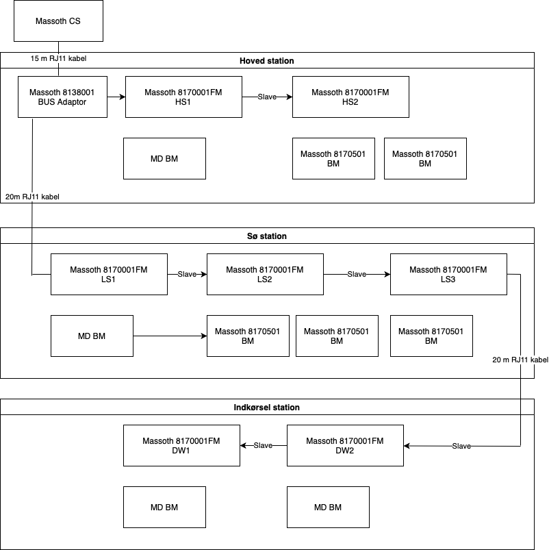

## Trackplan


### Signal

| Station  | track  | Sinal    | Placment    | SW | Address | CV High     | CV Low     | Default | Decoder |
|----------|--------|----------|-------------|----|---------|-------------|------------|---------|---------|
| Main     | 1      | sgMsp1s- | Main        | 1  | 420     | 1           | 164        | Red     | Buildin |
|          |        |          |             | 2  | 421     | 1           | 165        |         |         |
|          | 2      | sgMsp2s+ | Main        | 1  | 422     | 1           | 166        | Red     | Buildin |
|          |        |          |             | 2  | 423     | 1           | 167        |         |         |
|          | 3      | sgHsp3-  | Main        | 1  | 424     | 1           | 168        | Red     | Buildin |
|          |        |          |             | 2  | 425     | 1           | 169        |         |         |
|          | 3      | sgHsp3+  | Main        | 1  | 426     | 1           | 170        | Red     | Buildin |
|          |        |          |             | 2  | 427     | 1           | 171        |         |         |

| Station  | track  | Sinal    | Placment    | SW | Address | CV High     | CV Low     | Default | Decoder |
|----------|--------|----------|-------------|----|---------|-------------|------------|---------|---------|
| Lake     | 1      | sgLsp1s- | Lake        | 1  | 405     | 1           | 149        | Green   | Buildin |
|          | 2      | sgLsp2s+ | Lake        | 1  | 406     | 1           | 150        | Red     | Buildin |
|          |        |          |             | 2  | 407     | 1           | 151        |         |         |

| Station  | track    | Sinal    | Placment    | SW  | Address | CV High     | CV Low     | Default | Decoder |
|----------|----------|----------|-------------|-----|---------|-------------|------------|---------|---------|
| Driveway | 1        | sgIsp1+  | Small house | 1:1 | 450     | 1           | 194        | Red     | LSD     |
|          |          |          |             | 1:2 | 451     | 1           | 195        | Red     | LSD     |
|          | 3        | sgIsp3-  | Small house | 2:1 | 452     | 1           | 196        | Red     | LSD     |
|          |          |          |             | 2:2 | 453     | 1           | 197        | Red     | LSD     |
|          | 1        | sgIsp1-  | Well        | 1:1 | 454     | 1           | 198        | Red     | LSD     |
|          |          |          |             | 1:2 | 455     | 1           | 199        | Red     | LSD     |
|          | 3        | sgIsp3+  | Well        | 2:1 | 456     | 1           | 200        | Red     | LSD     |
|          |          |          |             | 2:2 | 457     | 1           | 201        | Red     | LSD     |


| From       | To         | Sinal     | Placment    | SW | Address | CV High     | CV Low     | Default | Decoder |
|------------|------------|-----------|-------------|----|---------|-------------|------------|---------|---------|
| Ter.sw     | Lake       | sg8-      | Lake        | 1  | 401     | 1           | 145        | Green   | Buildin |
|            |            |           |             | 2  | 402     | 1           | 146        |         |         |
| Lake       | Ter.sw     | sg8+      | Ter.sw      | 1  | 403     | 1           | 147        | Red     | Buildin |
|            |            |           |             | 2  | 404     | 1           | 148        |         |         |
| Main North | Lake In    | sgSpHInw+ | Lake        | 1  | 458     | 1           | 202        | Red     | Buildin |
|            |            |           |             | 2  | 459     | 1           | 203        |         |         |
| Lake In    | Main North | sgSpHInw+ | Lake        | 1  | 460     | 1           | 204        | Red     | Buildin |
|            |            |           |             | 2  | 461     | 1           | 205        |         |         |
| Main Norh  | Driveway   | sgIspHn-  | Lake        | 1  | 462     | 1           | 206        | Red     | Buildin |
|            |            |           |             | 2  | 463     | 1           | 207        |         |         |


#### Programming
**Buildin MD SH-12**
- Address SW1 High CV120 value from table
- Address SW1 Low CV121 value from table
- Address SW2 High CV125 value from table
- Address SW2 Low CV126 value from table
- Signal type CV49 value 38

**2 in 1 MD LSD**
- Signal type CV14 Mode 2 3 light signal CV value 2
- Address Signal 1 SW 1 High CV20
- Address Signal 1 SW 1 Low C21
- Address Signal 1 SW 2 High CV22
- Address Signal 1 SW 2 Low C23
- Address Signal 2 SW 1 High CV24
- Address Signal 2 SW 1 Low C25
- Address Signal 2 SW 2 High CV26
- Address Signal 2 SW 2 Low C27

#### Rocrail

**Signal 3 aspects**

Interface tab


Detail tab


### Sensors

#### MD

Overview of the RBM setup 


The source to the picture https://app.diagrams.net/#HMaxWinther%2Frocrail%2Fmain%2Frbm-setup.drawio

**MD BM programming**
- CV30 Current detection L1, default 5
- CV31 Current detection L2, default 5
- CV32 Current detection L3, default 5
- CV33 Current detection L4, default 5

**Rocrail Setup**
Sensors are mapped to mXion in the interface tab setting the follwing
- `Interface ID` to md
- `Node ID` aka `Bus` for Z21 protocol to 1 which actually stands for responses comming from LocoNet
- `Address` is set to the programmed address in RBM plus 1

#### Massoth

Overview of RM setup



The source to the picture https://app.diagrams.net/#HMaxWinther%2Frocrail%2Fmain%2Fmassoth_feedback_layout.drawio


How to integrate MD BM and Massoth RM


The source to the picture https://app.diagrams.net/#HMaxWinther%2Frocrail%2Fmain%2FMD_BM_to_Massoth_RM_8170001.drawio

Remember to program CV 65, 75 and 85 same as CV 55

**Usage**

From tables below in phase 1, isolators 31 and 21
- Main station 6 and 4
- Lake station 6 and 4
- Driweway station 6 and 4
- Main line 13 and 9

From tables below in phase 2, isolators 20 and 14
- Main station 16 and 11
- Main line 4 and 3

Feedback modules
1. Main station; block track 1 and track 2. Main line block to Terrase switch, and one sensor in block Lake to Terrase switch. One free sensor
2. Lake station; block track 1 and track 2. Main Line switch to Lake, and two sensors in block Lake to Terrase switch.  No free sensors.
3. Driveway; blocks and sideways on station plus single main line block. No free sensors


| Station | Track | Block | Isolartor | Sensor | Phase | FB              |
|---------|-------|-------|-----------|--------|-------|-----------------|
| Main    | 1     |       | 3         | 2      | 1     | HS1:1 HS1:2     |
|         | 2     |       | 3         | 2      | 1     |                 |
|         | 3     |       | 4         | 3      | 2     |                 |
|         | 4N    |       | 3         | 2      | 2     |                 |
|         | 4S    |       | 3         | 2      | 2     |                 |
|         | 5N    |       | 3         | 2      | 2     |                 |
|         | 5N    |       | 3         | 2      | 2     |                 |
| Total   |       |       | 6         | 4      | 1     |                 |
|         |       |       | 16        | 11     | 2     |                 |


| Station | Track | Block | Isolartor | Sensor | Phase | FB              |
|---------|-------|-------|-----------|--------|-------|-----------------|
| Lake    | 1     |       | 3         | 2      | 1     | LS1:1:324 LS1:2 |
|         | 2     |       | 3         | 2      | 1     |                 |
| Total   |       |       | 6         | 4      | 1     |                 |


| Station | Track | Block | Isolartor | Sensor | Phase |FB               |
|---------|-------|-------|-----------|--------|-------|-----------------|
| Driveway| 1     |       | 3         | 2      | 1     | DW1:1 DW1:2     |
|         | 2     |       | 1         | 1      | 3     |                 |
|         | 3     |       | 3         | 2      | 1     | DW2:1 DW2:2     |
|         | 4     |       | 1         | 1      | 3     |                 |
| Total   |       |       | 6         | 4      | 1     |                 |


| From    | To      | Block   | Isolartor | Sensor | Phase |FB                |
|---------|--------|----------|-----------|--------|-------|------------------|
| Main    | Ter.sw | bkHspHe  | 3         | 2      | 1     | HS1:3 HS1:4      |
| Ter.sw  | Lake   | bkspHLn  | 4         | 3      | 1     | LS1:3:324 LS1:4  |
| Driveway| Switch | bkIspHn  | 3         | 2      | 1     | DW1:3 DW1:4      |
| Switch  | Lake   | bkspHInw | 3         | 2      | 1     |                  |
| Main    | Ter.sw | bkHspHs  | 4         | 3      | 2     |                  |
| Total   |        |          | 13        | 9      | 1     |                  |


## rocrail.ini


### Set up mXion

The property
- `xnetgbm` enables feedback via Loconet
- `host` ip-address of CS mXion; Upladsgade 10.76.215.157, Sommerhus 192.168.8.197
- `libpath` actual path to drivers in the rocrail install

**MacOS**
```
<digint lib="z21" iid="md" port="21105" uid="0" 
    host="10.76.215.157" locolist="false" absent="false" xnetgbm="true" swtime="250" protver="0" desc="mXion" 
    ignorepowercmds="true" 
    ignorepoweroffonghost="false" 
    show="true" swapgates="false" stress="false" guid="0000ACDE480020210303160626126000" 
    libpath="/Applications/Rocrail.app/Contents/MacOS"/>
```


### Set up webclient

```
<webclient 
    port="8081" 
    webpath="web" 
    imgpath="images" 
    svgpath1=svg/themes/SpDrS60" 
    svgpath2="." 
    svgpath3="." 
    svgpath4="." 
    svgpath5=".">
    <rocweb/>
</webclient>
```

## Raspberry PI

### Install new server version
- Follow download instructions from https://wiki.rocrail.net/doku.php?id=download-int#raspberry_pi
- Download to ```/home/pi/Downloads```
- Unzip into ```sudo unzip -u Rocrail-PiOS11-ARMHF.zip -d /opt/rocrail-[VERSION]-[DDMMYYY]```
- Remove old symbol-link ```sudo  rm /opt/rocrail```
- Create net symbol-link ```sudo  ln -s rocrail-[DD-MM-YYY] rocrail``` in opt-folder
- Create symbol-link in new folder to rocrai-bin like ```sudo ln -s bin/rocrail rocrail``` to make init.d work

### Setup
Installed and runing from aka working-directory
```
/home/pi/rocrail/testPlan
```

Symbolic links in working directory, only done once
- web ```ln -s /opt/rocrail/web web```
- svg ```ln -s /opt/rocrai/svg svg```

### Start/stop
- Stop: ```sudo /etc/init.d/rocraild stop```
- Start: ```sudo /etc/init.d/rocraild start```
- Status: ```/etc/init.d/rocraild status```

## MacOS

### Setup
Symbolic links created by installation

After new installation of rocrail channges svg to

```/Applications/Rocrail.app/Contents/Resources/svg```
